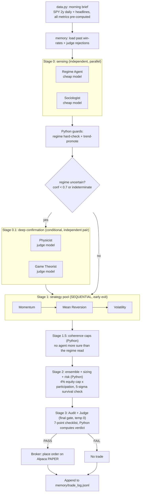

# AI Trader: a research desk of specialists that argue before every trade

This is a multi-agent, paper-trading system. Picture a small trading desk. A
handful of specialists each read the same morning brief, give their opinion, and
argue. Above them sits an editor-in-chief who trusts no one blindly, checks the
arithmetic, and signs off on the trade. Here the specialists are LLM agents
(Gemini). The editor-in-chief is plain Python.

> **The one rule that shapes everything.**
> Python owns every decision and does every calculation. The LLMs never touch a
> number they were not given, never size a position, never place an order. They
> read pre-computed metrics and return a judgement. Every threshold, every veto,
> every dollar figure lives in code, where it can be tested and cannot be
> hallucinated. The agents advise. The code decides.

---

## 1. The morning brief: the data that enters the system

**File: `data.py`.** Once per cycle the desk pulls one instrument (SPY by
default), two years of daily candles from Yahoo Finance, plus recent headlines.
Then Python computes every number the agents will reason about. Nothing is left
for an LLM to calculate.

The brief is grouped by what it describes:

| Group | Numbers | Who reads it |
|---|---|---|
| **Trend structure** | `adx`, `sma20/50/200` stack, `returns_1m/3m/12m` | Regime, Momentum |
| **Mean-reversion** | `bb_position` (place inside Bollinger bands), `atr` | Mean Reversion |
| **Volatility** | `atr_avg20_ratio`, `vol_21d_annualized`, `realized_vol_ratio` | Volatility, Risk |
| **Fractal / chaos** | `hurst`, `fractal_dim_60d` vs `fractal_dim_prev60d` | Physicist |
| **Crowd** | `volume_ratio_5d_vs_60d`, `up_days_last_10`, `pct_from_52w_high` | Game Theorist |
| **Tail risk** | `kurtosis` (fat tails) | Regime, Physicist, Risk |
| **Narrative** | recent `headlines` (title + date) | Sociologist |

Two of these are custom-built rather than off-the-shelf:
- **Hurst exponent** (`hurst_exponent`): rescaled-range slope on log prices. It
  measures whether the series trends or mean-reverts.
- **Katz fractal dimension** (`fractal_dimension`): how jagged the recent path
  is. A rise from the previous window hints that a regime break is coming.

Everything downstream is an interpretation of this one JSON brief.

---

## 2. The cast: each agent, its job, what it measures, and the paper behind it

Every agent has a single job, must cite a number for every claim, must give a
four-step reasoning trace (assess, apply rule, counter-argument, uncertainty),
and is forbidden vague language ("looks strong", "clearly"). Confidence above 0.8
requires at least two independent confirming numbers. These rules live in
`prompts.py` (`_COMMON_RULES`).

### Sensing agents (read the market, never pick direction)

**Regime Agent.** *What kind of market is this?*
Plain English: is the market climbing, falling, drifting sideways, or wild?
Classifies: trending bull / bear, ranging, high-volatility, or indeterminate.
- **Reads:** `adx`, the SMA stack, `hurst`, `atr_avg20_ratio`, `kurtosis`.
- **Papers:** Hamilton (1989), a regime is a probability, not a certainty;
  Wilder, ADX at or above 20 with an aligned SMA stack is a trend; Peters (1994),
  Hurst below 0.45 mean-reverts and above 0.55 trends; Mandelbrot (1963),
  kurtosis above 6 means fat tails that hide risk.

**Physicist (chaos / complex-systems analyst).** *Do the deep metrics confirm or veto the regime?*
Plain English: a second opinion that double-checks the market read with deeper math.
A heavier opinion, called only when the Regime read is shaky.
- **Reads:** `hurst`, `fractal_dim_60d` vs `fractal_dim_prev60d`, the return
  ladder, `atr_avg20_ratio`, `kurtosis`.
- **Papers:** Peters (1994), the random-walk zone forbids a regime claim; Katz,
  fractal dimension separates smooth trend from turbulence and a jump above 0.15
  flags a coming break; Sornette (2003), a super-exponential return ladder plus
  expanding vol is a bubble signature; Mandelbrot (1963), fat tails.

**Game Theorist.** *What is the crowd doing?*
Plain English: is everyone piling onto one side and about to get squeezed?
Detects herding, exhaustion, and capitulation from participation.
- **Reads:** `up_days_last_10`, `volume_ratio_5d_vs_60d`, `pct_from_52w_high`,
  `returns_1m`.
- **Papers:** Camerer (2003), a rally on fading volume is a crowded long;
  Keynes' beauty contest, price at highs with falling volume is momentum chasers
  without new buyers. It has no order-book data, so it is explicitly banned from
  claiming manipulation and abstains most cycles.

**Sociologist (social change / narrative analyst).** *What story is moving capital?*
Plain English: what story is the market telling, and is it catching on or fading?
Reads the headlines and names the single dominant narrative and its direction.
- **Reads:** `headlines`, and the previous cycle's narrative (to report the delta).
- **Paper:** Shiller (2019), *Narrative Economics*. Narratives spread like
  epidemics and move money before fundamentals, so track the contagion, and a
  narrative shift is the signal while a repeated story is background. Every claim
  must quote a real headline.

### Strategy agents (the only ones that pick buy / sell)

**Momentum.** Trend-following only.
Plain English: ride what is already moving.
- **Reads:** `returns_3m/12m`, the SMA stack, `adx`, `realized_vol_ratio`.
- **Papers:** Jegadeesh & Titman (1993), 3 to 12 month winners persist;
  Moskowitz & Pedersen (2012), positive 12m and 1m is strongest; Daniel &
  Moskowitz (2016) and Barroso & Santa-Clara (2015), momentum crashes in
  high-vol rebounds after panics, so it halves confidence on that signature.

**Mean Reversion.** Overbought / oversold only.
Plain English: bet that a stretched price snaps back.
- **Reads:** `bb_position`, `hurst`, `atr`, `last_price`.
- **Papers:** Poterba & Summers (1988), reversion works over weeks to months, not
  days; Bollinger, enter only outside the bands and only in a ranging regime. A
  signal without a 2x ATR stop is incomplete.

**Volatility.** Breakout / expansion only.
Plain English: trade the breakout once the market wakes up.
- **Reads:** `atr_avg20_ratio`, `returns_1m`.
- **Papers:** Mandelbrot (1963) and Engle (1982), volatility clusters, so trade
  with a confirmed expansion and never anticipate one. Below a 1.1 ratio there is
  no case and it abstains.

### The gate

**Audit + Judge.** *The editor-in-chief who signs or spikes the trade.*
Plain English: the strict editor who kills sloppy or overconfident trades.
Reviews the entire decision package and works a fixed seven-point checklist. It
has no stake in trading. A correctly rejected bad trade is a win, and if it
upholds more than 80% of packages it is failing at its job.
- **Reads:** every agent's output, the ensemble arithmetic, the order intent, its
  own past rejections, and each strategy's real win-rate by regime.
- **Papers:** Kahneman (2011), are the counter-arguments real or strawmen, is
  there confirmation bias; Tetlock (2005), any confidence above 0.8 needs two
  independent confirming numbers; Reason (1990), hunt aligned holes (for example
  everyone said buy-trend while Hurst said mean-revert and no one addressed it);
  Lopez de Prado, win rates under 20 trades are noise, not a prior.
- **Important:** the Judge does **not** declare the verdict. It attests each
  checkpoint true or false, and **Python computes the verdict**. All seven must
  pass or the trade is rejected. The LLM cannot hand-wave a PASS.

---

## 3. The flow of one cycle: what runs in parallel, what runs in sequence

Not everything is a chain. Some agents are independent and form a fan-out stage.
Others are deliberately sequential. Between every LLM stage, Python runs
deterministic guards.



**Read the parallel-versus-sequential intent this way:**
- **Independent (fan-out):** Regime and Sociologist read the same brief but not
  each other, so they are a parallel sensing stage. Same for the Physicist and
  Game Theorist pair.
- **Sequential on purpose:** the three strategies run one after another so the
  cheap early-exit can fire. If momentum and mean-reversion already agree
  strongly, volatility is never called. That is cost control by design.
- **Deterministic between every stage:** hard gates, coherence caps, sizing, and
  the final verdict are all pure Python. The LLMs never get the last word.

---

## 4. Memory: the desk learns between cycles

**File: `memory.py`.** Before each cycle, Python re-scores past trades against
today's price and rebuilds a context the agents receive as their prior:
- **strategy win-rate by regime:** an agent's real track record, used as a prior
  only past 20 trades because below that it is noise;
- **recent regime history:** the last ten regimes;
- **the Judge's own rejection patterns:** so a repeated flagged pattern is
  stronger grounds for rejection.

The desk's opinions today are shaped by how it actually did yesterday.

---

## 5. Measurement to paper, at a glance

| Measurement | Meaning | Paper / source |
|---|---|---|
| `adx` + SMA stack | trend strength and direction | Wilder |
| `hurst` | trend vs mean-revert | Peters (1994) |
| `fractal_dim` shift | coming regime break | Katz |
| return ladder + vol | bubble signature | Sornette (2003) |
| `kurtosis` | fat tails | Mandelbrot (1963) |
| `returns_3m/12m` | momentum persistence | Jegadeesh & Titman (1993) |
| 12m vs 1m sign | momentum crash risk | Daniel & Moskowitz (2016) |
| `bb_position` | reversion entry | Bollinger; Poterba & Summers (1988) |
| `atr_avg20_ratio` | volatility clustering | Engle (1982) |
| volume vs up-days | herding / exhaustion | Camerer (2003); Keynes |
| headlines | narrative contagion | Shiller (2019) |
| confidence audit | overconfidence / bias | Tetlock (2005); Kahneman (2011) |
| win-rate priors | small-sample noise | Lopez de Prado |

---

## 6. Setup and run

```
pip install -r requirements.txt
copy .env.example .env      # fill in your keys
python run_trade_cycle.py
```

`.env` keys: `GEMINI_API_KEY` (aistudio.google.com), `ALPACA_API_KEY` /
`ALPACA_SECRET_KEY` (paper keys from alpaca.markets), `SYMBOL` (default SPY).

- **Models:** cheap tier (`gemini-flash-lite`) for the sensing and strategy
  agents, stronger tier (`gemini-flash`, temperature 0) for the Physicist, Game
  Theorist, and the final Judge. Each call retries and walks a fallback chain
  (`llm.py`).
- **Schedule:** once per trading day at 09:35 ET (`.github/workflows/trade.yml`,
  or a local scheduled task).

## Status

Paper trading only. The gate before any live money is deliberately strict:
**100+ trades, win rate above 55%, profit factor above 1.5, max drawdown below
15%.** Until then, the point is the process, not the profit.
